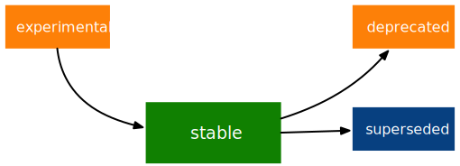
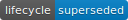

```{r, include = FALSE}
knitr::opts_chunk$set(
  collapse = TRUE,
  comment = "#>"
)
```

```{r setup}
library(lifecycle)
```

Use lifecycle to document the status of your exported functions and arguments.
It provides a standard way to describe lifecycle stage in the documentation, and tools to encourage users away from deprecated functions.

## Stages

The lifecycle stages for functions[^1] are summarised in the figure below.

[^1]: They can also be applied to individual arguments, or combinations of argument values.



The default development stage is {style="vertical-align:middle"}.
A function is considered stable when the author is sufficiently happy with its interface and behaviour to share it with a large number of users.
Stable features come with guarantees.
If breaking changes are needed, they will occur gradually, through the deprecation process described below.

The stability of exported functions can be further refined based on the version number of the package they are exported from.
In \>=1.0.0 packages, the main functionality is considered "done" by the author.
Breaking changes and deprecations are unlikely.
In sub-1.0.0 packages, some parts of the package (internal backend, external UI, ...) still need some work and changes are possible.
Stable \>=1.0.0 packages are the safest to depend and rely on.

Some packages and functions are published in an {style="vertical-align:middle"} stage.
Experimental features are made available so people can try them out and provide feedback, but the author makes no promises to avoid breaking changes.
A deprecation process for breaking changes is not guaranteed (but may still happen if sufficiently many users depend on the feature).

### End of life

There are two ways that a function might reach the end of its life: it might be superseded or deprecated.

-   A [^2] function has a better alternative available, but the function itself is not going away. While a superseded function will not receive new features, it will be kept working for the foreseeable future so that existing code does not need to change. A superseded feature preserves all the guarantees of a stable feature, and is just as safe to use.
-   A {style="vertical-align:middle"} function has a better alternative available and will be removed in the near future. Deprecated functions should also produce a message describing the alternative, and whenever you encounter a deprecation message in your code, you should make fixing it a priority.

[^2]: This stage was previously called retired.

Particularly important functions can have two additional stages in the deprecation cycle:

-   Soft-deprecated comes before deprecated.
    It's a gentler form of deprecated designed to prevent new uses of a function and encourage package developers to move to a new for.
    Soft deprecated allows a package to change its extension interface in a way that downstream dependencies can adapt to before users are forced to change.

-   Defunct comes after deprecated.
    A defunct function is still exported, and a defunct argument is still part of the signature, but their usage will generate informative errors.

Sometimes the author of function is no longer certain that a function is the optimal approach, but doesn't yet know how to do it better.
These functions can be marked as {style="vertical-align:middle"} to give users a heads up that the author has doubts about the function.

## Documentation {#rd-badges}

Experimental, questioning, superseded, and deprecated (including soft-deprecated and defunct functions) should be clearly labelled in the document with a badge:

-   Call `usethis::use_lifecycle()` to import the badges in your package.
    Then use `lifecycle::badge()` to insert a badge:

        #' `r lifecycle::badge("experimental")
        #' `r lifecycle::badge("deprecated")

    This badge renders as text in non-HTML documentation.
    To document the status of a whole function, a good place to include the badge is at the top of the `@description` block.
    To document an argument, you can put the badge in the argument description.

-   You should also include a brief description of why the function is in that state.

-   For superseded and deprecated functions, rewrite the examples showing how to translate from the old to new syntax.

-   For deprecated functions, add `@keywords internal` and update `_pkgdown.yaml` (if you use pkgdown), so that they're no longer listed in documentation indexes.

## Signals

Deprecated functions should clearly signal their deprecation status.
There are three levels of verbosity:

-   **Soft deprecation**: Call `deprecate_soft()` to start warning users about the deprecation in the least disruptive way.
    This function only warns (a) users who try the feature from the global workspace (at most once every 8 hours), and (b) developers who directly use the feature (when running testthat tests).
    No warning is when the deprecated feature is called indirectly by another package.

-   **Deprecation**: Call `deprecate_warn()` to warn unconditionally about the deprecated feature.
    The warning is issued only once every 8 hours.

-   **Defunct**: Call `deprecate_stop()` to fail with an error.

The following sections describe the details when deprecating functions and arguments.

### Functions

The first two arguments give the version where deprecation occurred[^3] and a description of what is deprecated:

[^3]: If the function goes through multiple deprecation stages, this stays the same.

```{r}
deprecate_warn("1.0.0", "mypkg::foo()")
```

Where possible, describe the replacement in the third argument:

```{r}
deprecate_warn("1.0.0", "mypkg::foo()", "new()")
```

We explicitly mention the namespace in these examples, but you can typically omit the namespace because lifecycle will infer it from the calling environment.
Specifying the namespace is mostly useful when the replacement is implemented in a different package.

```{r}
# The new replacement
foobar_adder <- function(foo, bar) {
  foo + bar
}

# The old function still exported for compatibility
foobaz_adder <- function(foo, bar) {
  deprecate_warn("1.0.0", "foobaz_adder()", "foobar_adder()")
  foobar_adder(foo, bar)
}
```

### Arguments

The syntax for deprecating arguments is similar:

```{r}
deprecate_warn("1.0.0", "mypkg::foo(arg = )")

deprecate_warn("1.0.0", "mypkg::foo(arg = )", "mypkg::foo(new = )")
```

An argument can be partially deprecated by disallowing certain input types:

```{r}
deprecate_warn("1.0.0", "mypkg::foo(arg = 'must be a scalar integer')")
```

lifecycle also provides the `deprecated()` sentinel to use as default argument.
This provides self-documentation for your users and makes it possible for external tools to determine which arguments are deprecated.
Test whether the argument was supplied by the caller with `lifecycle::is_present()`:

```{r}
foobar_adder <- function(foo, bar, baz = deprecated()) {
  # Check if user has supplied `baz` instead of `bar`
  if (lifecycle::is_present(baz)) {

    # Signal the deprecation to the user
    deprecate_warn("1.0.0", "foobar_adder(baz = )", "foobar_adder(bar = )")

    # Deal with the deprecated argument for compatibility
    bar <- baz
  }

  foo + bar
}
```

## Workflow

### Where do these deprecation warnings come from?

Call `lifecycle::last_warnings()` to see backtraces for all the deprecation warnings that were issued during the last top-level command.

### Bumping deprecation stage

Some manual search and replace is needed to bump the status of deprecated features.
We recommend starting with defunct features and work your way up:

1.  Search for `deprecate_stop()` and remove the feature from the package.
    The feature is now archived.

2.  Search for `deprecate_warn()` and replace with `deprecate_stop()`.

3.  Search for `deprecate_soft()` and replace with `deprecate_warn()`.

4.  Call `deprecate_soft()` from newly deprecated functions.

Don't forget to update the badges in the documentation topics.

### Find out what deprecated features you rely on

Test whether your package depends on deprecated features directly or indirectly by setting the verbosity option in the `tests/testthat.R` file just before `test_check()` is called:

```{r, eval = FALSE}
library(testthat)
library(mypackage)

options(lifecycle_verbosity = "error")
test_check("mypackage")
```

This forces all deprecated features to fail.
You can also set the relevant options manually to force warnings or errors in your session:

```{r, eval = FALSE}
# Force silence
options(lifecycle_verbosity = "quiet")

# Force warnings
options(lifecycle_verbosity = "warning")

# Force errors
options(lifecycle_verbosity = "error")
```

Forcing warnings can be useful in conjuction with `last_warnings()`, which prints backtraces for all the deprecation warnings issued during the last top-level command.

### Test deprecated features

Test whether a deprecated feature still works by setting `lifecycle_verbosity` to `"quiet"`:

```{r, eval = FALSE}
test_that("`baz` argument of `foobar_adder()` still works", {
  withr::local_options(list(lifecycle_verbosity = "quiet"))
  foobar_adder(1, baz = 2)
})
```

You can also set up verbosity for a whole testthat file within `setup()` and `teardown()` blocks:

```{r, eval = FALSE}
setup(options(lifecycle_verbosity = "quiet"))
teardown(options(lifecycle_verbosity = NULL))
```

Test that a feature is correctly deprecated with `expect_deprecated()` or `expect_defunct()`:

```{r, eval = FALSE}
test_that("`baz` argument of `foobar_adder()` is deprecated", {
  expect_deprecated(foobar_adder(1, baz = 2))
})

test_that("`foo()` is defunct", {
  expect_defunct(foo())
})
```

More control over verbosity can be exercised with the `lifecycle_verbosity` option.
See `?verbosity`.
